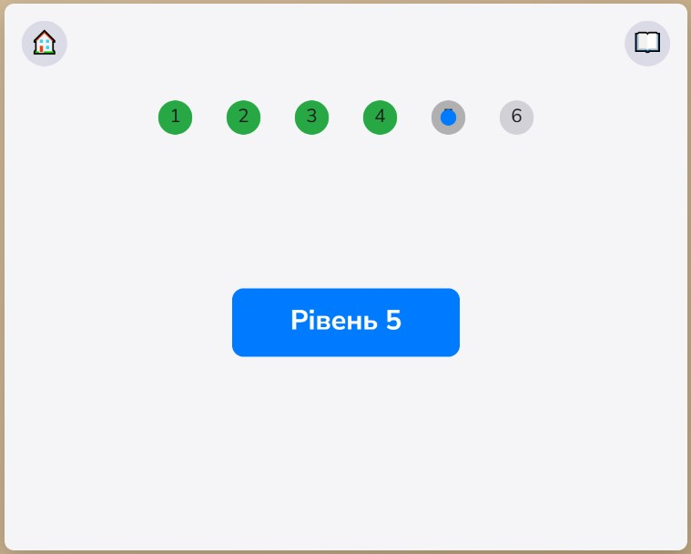
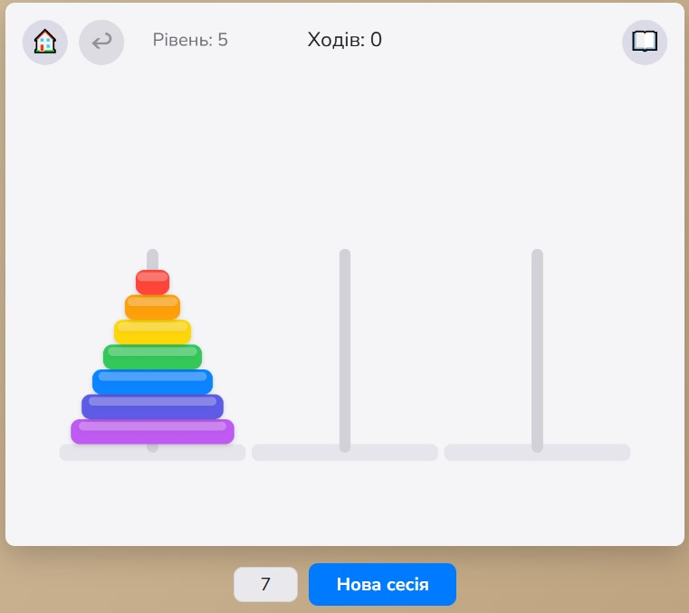

# Ханойська вежа (веб-гра)

## Правила гри

Ханойська вежа — класична математична головоломка, винайдена французьким математиком Едуардом Лукасом у 1883 році.

У грі є три стержні й декілька дисків різного діаметра, спочатку складених у порядку від більшого до меншого на одному стержні. Ваше завдання — перемістити всю «вежу» на інший стержень, пересуваючи по одному диску за раз і ніколи не кладучи більший диск на менший.

Мінімальна кількість ходів для n дисків дорівнює 2^n – 1, що робить гру водночас простою в правилах і глибокою за стратегією, адже з кожним доданим диском складність зростає експоненційно. Це відмінний тренажер для логічного мислення та планування наперед.

У випадку проходження рівня ідеально — автоматичний перехід на карту. У випадку неідеального проходження — гравцю дається змога перепройти рівень.

